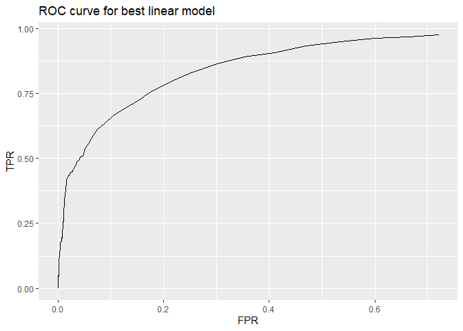

\#Q1 \## finding best linear model

lm2 = base modeal (made in class)

lm\_a = get rid of insignificant variables fireplaces, fuel from lm2

lm\_b = lm\_a + landvalue\*newconstruction

lm-c = lm\_b + lotSize\*landValue

lm\_d = lm\_b + lotSize\*livingArea

lm\_e = lm\_b + landValue\*livingArea

    ##      Avg of RMSE
    ## lm2     66918.60
    ## lm_a    66873.45
    ## lm_b    59107.21
    ## lm_c    59235.31
    ## lm_d    59144.59
    ## lm_e    59226.99

We can see above that our model lm\_b outperforms lm2 which was the
“medium” model discussed in class. This new model removes the fireplace
and fuel variables from lm2 and includes the interaction effect between
new construction and land value as well as the interaction between land
value and lot size. This model will be compared to a K nearest neighbors
regression model for price with appropriately scales variables that has
an optimal k value that is provided below. The K nearest neighbor
regression regressed on all variables except for pctCollege, sewer,
waterfront, fireplaces, or fuel.

    ## [1] 103

In our comparison we look at the average of the out-of-sample root mean
squared error after running both the knn regression and linear model
through 50 train-test-splits.

    ##              Avg of RMSE
    ## KNN             76268.87
    ## Linear model    58567.69

As we can see,The linear model certainly, on average, outperformed the
KNN regression in terms of average root mean squared error. We have
learned from this case study that for a particular price-modeling
strategy, it is important to include potentially relevant interaction
effects involving the value of the land that the property is situated
on. This effect changes when its new construction or when the lot is a
different size. We can also see that the KNN regression has weaker
performance than the in class “medium” model. this this is likely due to
the difference between the meaning of an increase or decreases in units
varies greatly depending on the variable in question, even though the
data is demeaned and scaled. For example, an increase in bathrooms has a
very different effect inthe change in house price than the increase in
the square footing which may include the bathroom size. Due to this
inconsistency, looking in a n-dimensional space for the values that are
numerically closer to each other overall may not provide an accurate
descriptor of similar houses. However this differences in partial
effects would be picked up as the coefficients in the linear model.

# Q2: Classification and retrospective sampling

    ##         (Intercept)            duration              amount         installment 
    ##       -7.075258e-01        2.525834e-02        9.596288e-05        2.216019e-01 
    ##                 age         historypoor     historyterrible          purposeedu 
    ##       -2.018401e-02       -1.107586e+00       -1.884675e+00        7.247898e-01 
    ## purposegoods/repair       purposenewcar      purposeusedcar       foreigngerman 
    ##        1.049037e-01        8.544560e-01       -7.959260e-01       -1.264676e+00

We have provided above, a par plot measuring the probability of
defaulting on the loans for each section of credit history as well as
logistic regression that predicts the default probability using the
variables duration, amount, installment, age, history, purpose, and
foreign. Interestingly, and counter intuitively, we would predict in the
logistic regression that, holing all else the same, that we expect
someone moving from good credit history to bad or terrible credit
history would decrease the chances of defaulting. Similarly, we see in
the bar plot, the better the credit history, the higher the chances of
defaulting are. This should likely not be the case as a better credit
history means the borrower consistently pays off debt in time.
Therefore, this would not be a good model to predict defaults in
screening prospective loan customers. We believe that this contradiction
has resulted from the experiment design process. Because there are so
few defaults, artificially inflating the proportion of defaults in the
data set is likely changes the proportions of the good credit history
category using a data collection process that is not random. A better
representation of default probabilities would result from random
sampling of all loans offered rather than oversampling defaults. The
bank need need to include more data in random sampling set if there are
such few defaults at this bank. Collecting too little data may result in
no defaults in the set.

# Q3 Children and hotel reservations

### Model building

    ##       out-of-sample accuracy rate
    ## base1                   0.9185400
    ## base2                   0.9343689
    ## best                    0.9358644

Above are the averages of out-of-sample accuracy rates across 50
train-test-splits for the two base models and a third model which is the
2nd model plus the interaction effects of adults on room\_type and
special\_requests, also, the interaction effect of booking changes with
meal. We see that we are able to correctly identify if a child will
arrive with the parents about 93.6% of the time.

### Model validation: step 1

Using the third model mentioned previously, here we see the ROC curve on
the validation data set as we vary the classification threshold from 0
in the bottom left to 1 in the top right.

### Model validation: step 2

    ##    fold total_count exp_children actual_children
    ## 1     1         250         20.8              22
    ## 2     2         250         20.9              19
    ## 3     3         250         20.6              20
    ## 4     4         250         24.3              25
    ## 5     5         250         19.3              23
    ## 6     6         250         20.9              21
    ## 7     7         250         20.5              23
    ## 8     8         250         15.4              12
    ## 9     9         250         19.9              19
    ## 10   10         250         20.6              21
    ## 11   11         250         27.8              24
    ## 12   12         250         20.6              21
    ## 13   13         250         18.3              10
    ## 14   14         250         20.9              19
    ## 15   15         250         24.5              22
    ## 16   16         250         19.9              23
    ## 17   17         250         18.7              23
    ## 18   18         250         20.5              18
    ## 19   19         250         26.5              20
    ## 20   20         249         19.6              17

As we can see in the table above, for each of the 20 folds of the data
we have the expected number of children and the actual number. In some
of the folds we get very close (within 0.1 child in folds 5 and 9) and
other times a little bit further way (about 5 off in fold 3). Within
each of the 20 folds it seems that we don’t have our 93.6% accuracy when
we use the same data set to train and test in. However, the fact that we
are within 5 children every time, it seems this model would be quite
helpful in predicting the total number of bookings with children
especially because of how quickly this runs, it could provide some
helpful insight for a hotel manager when it comes to resource allocation
for each day.

# Q4 Mushroom classification

    ## [1] 0.004995874

The plot above showcases how the deviance changes as lambda changes. We
see that the lambda value that minimizes the deviance is presented just
below the plot at around 0.005. Using this optimal lambda, we plot the
ROC curve to evaluate the out-of-sample performance of our model. We
also provide the optimal threshold to set.

    ##   threshold
    ## 1 0.5001929

Notice that the ROC curve makes a perfect right angle. This perfect AUC
score suggests that the model is highly capable of distinguishing
between poisonous and edible mushrooms, with minimal error. The
probability threshold is suggested to be 0.5001403. We then use the
threshold in making our predictions and the following confusion matrix
computes the amount of predictions that were made correctly and
incorrectly. As the ROC plot would suggest, there are no incorrect
predictions.

    ##          Actual
    ## Predicted   0   1
    ##         0 798   0
    ##         1   0 826

    ## [1] "False Positive Rate: 0"

    ## [1] "True Positive Rate: 1"

Based on this confusion matrix, the FPR is 0 (as there are 0 false
positives) and the TPR is 1 (as there are no false negatives). These
values indicate that the model is achieving perfect classification
performance. It is exceptionally effective at identifying poisonous
mushrooms without mistakenly classifying edible ones as poisonous, but
perfect performance can also sometimes indicate over fitting.
