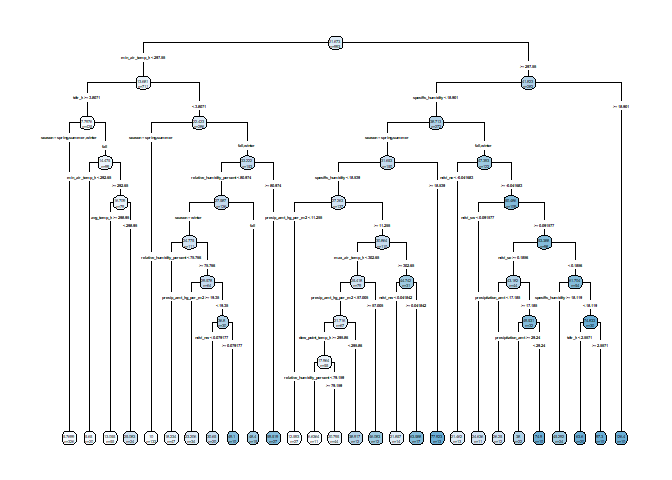
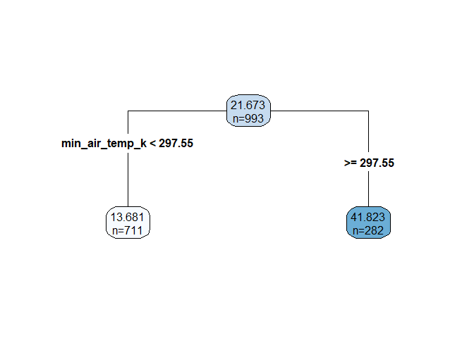
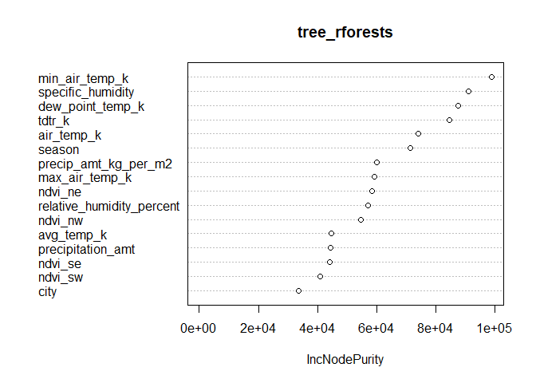
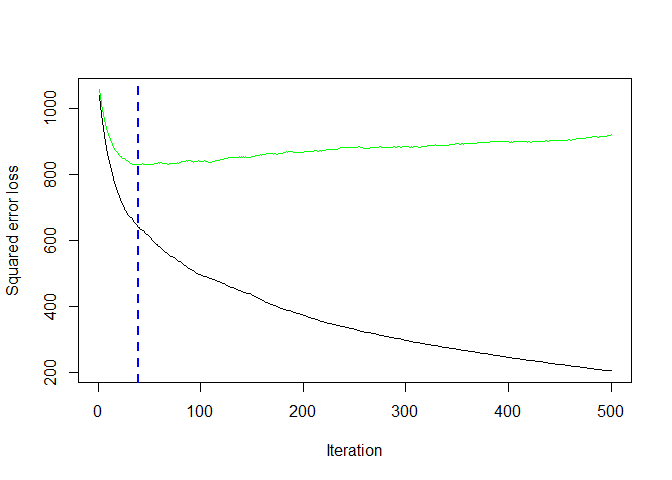
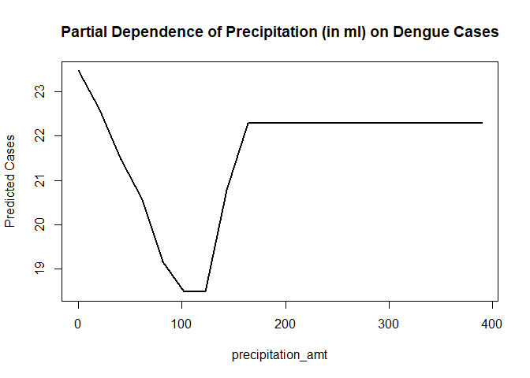
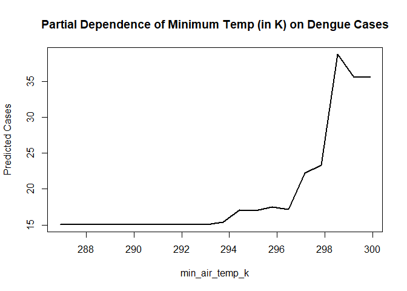
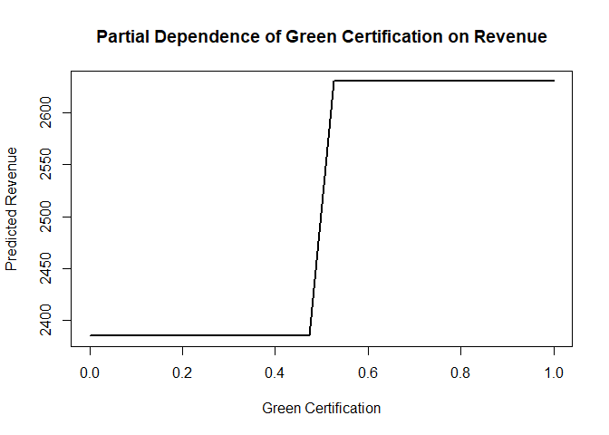
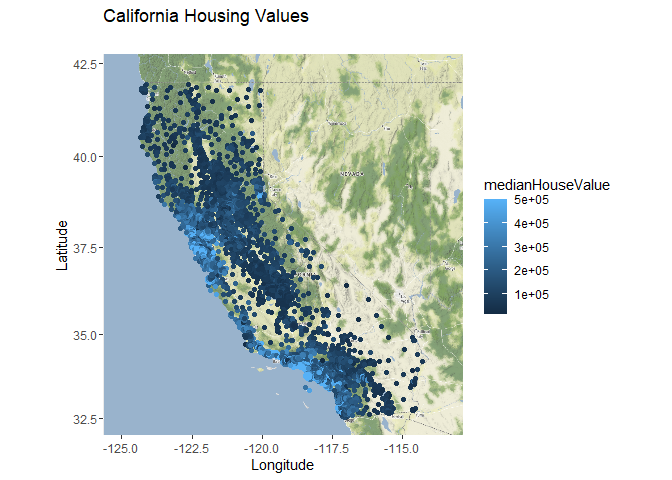
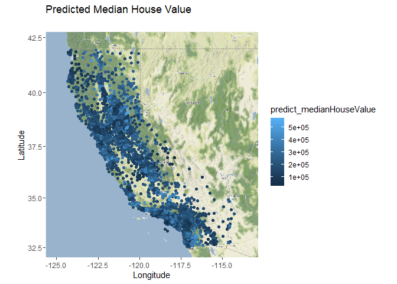
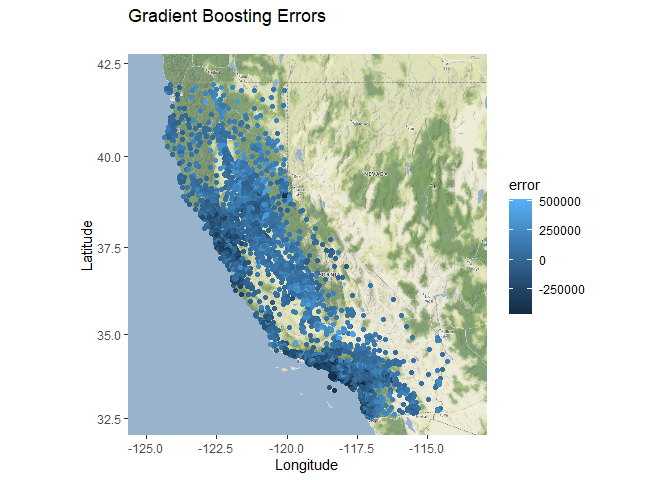

# Q1: What causes what?

## 1

We can’t get causation by regressing one equation. For example, there
can be a third variable that causes crime to decline and police to
increase. In that case, we estimate a negative coefficient when we
regress crime on police, but it is due to the third variable, not
because the police cause crime to decrease. Also crime and police are
endogenous, very often the decision for the amount of funding to go to
the police department or how many to hire is partially based on the
crime level in the city. This third variable would likely be exogenous
but act through police to result in more or less crime.

## 2

High alert day is a instrument variable to police because it is highly
correlated with police(=instrument relevance) but not affected others
such as the number of people on the street. (They checked there is no
ridership decline in high alert day, instrument exogeneity). In the
table, model(1) represents that the number of crimes in DC decline by
7.3 in high alert day, and model(2) shows that the number of crimes
diminish by 6.0 holding all else fixed(it means that controlling for the
ridership). Both of these effects are significant at the 5% level
helping us get a better idea of a causal relationship.

## 3

Metro ridership represents a proxy for the potential number of people
who can be targeted by crime. If it is not controlled for, we would be
omitting a variable and would not be able to tell whether the number of
crimes declines due to the police or due to a decrease in the number of
people on the street who can be victims of crime.

## 4

In the model, the table shows the result of the regression the daily
total number of crimes on 3 explanatory variables. The explanatory
variables are dummy variables of High alert(or not), District 1(or not),
and one continuous variable log(ridership), and the model use the
interaction term between 2 dummy variables and log(ridership). When high
alert(=1), the number of crimes decrease by about 2.6 in District 1
compared to other district, holding all else fixed. But the result of it
in other districts, -0.57, is not statistically significant. Therefore,
the number of crimes in district 1 in High alert day is 2.61 lower than
that of other districts, holding all else fixed. This means that a high
alert may have a greater effect in stopping crime in district one than
the other districts.

# Q2: Tree modeling : Dengue cases

For this question we predict dengue cases (not log cases). We split the
data into a training set that accounts for 80% of the observations and a
testing set that is the remaining 20% of the observations. We calculate
our predictions on the testing set for the CART, random forest, and
gradient-boosted trees and compare the out of sample RMSE and find that
the gradient boosted tree has the smallest out of sample RMSE in
predicting dengue cases.

## 1: CART

We begin with the CART model, we provide below the full tree in which we
include all variables in the data set.We have the tree set so the
smallest split has at least 10 observations.

Let’s prune our tree at the 1 standard error complexity level. This is
the application of the 1SE rule to pick a tree that is simple but whose
performance is not discernibly different from the best performing model.
Below is this tree.

Although this tree is much simpler tree than the one previously, with
only the first split, the tree\_cart\_big is the best cart model
compared to pruned one. As we are more interested in performance than
interpretability, we will use the big tree in our comparisons as the
RMSE for the tree\_cart\_big is less than that of the CART pruned by 1
standard error. It is important to note that the minimum air temperature
appears correlate strongly with the number of cases.

## 2: random forest

Next, we provide some information on our random forest prediction
results. Random forests are effective, fast and require little or no
tuning via CV, and we found that the default settings do well for our
predictions. Below, we provide the variable importance plot showing when
we leave out a variable, how much does that increase mean squared error.

Here we see that the largest increase in mean squared error would be
achieved if we left out minimum air temperature and followed very
closely by dew\_point\_temperature which we also see as a main driving
point in the CART tree previously. The variable importance plot is made
using the training data but the RMSE was calculated using the testing
data is is shown below the next section about the gradient boosted tree.

## 3: gradient-boosted tree

Next we find the predictions of a gradient boosted tree. Below we
present the error curve that was used to find the amount of boosting
steps. We initially set the depth of of each tree to 4, using 500 trees
(like the in-class example), the shrinkage factor at it’s typical 0.05.

    ## Distribution not specified, assuming gaussian ...

    ## [1] 39

    ## Using 39 trees...

The error curve above is showing as a function of iteration number, how
the boosted trees are doing.

## 4: compare the models

We compile the root mean squared errors of the three methods which are
provided below.

    ##                   RMSE
    ## cart_big      22.06113
    ## random forest 20.01215
    ## boosted       17.76795

We see that the out of sample root mean square error of the boosted
trees is bit better than the other two. This agrees with our discussions
in class that if we construct the ensemble of trees in such a way that
the later we get in the tree, the more aware we are in the error of the
earlier trees that we can do better. As we are using count outcomes, and
making these trees assumes that the count outcomes are Gaussian, which
may not always be accurate.

## 5: partial plot

Below we now provide the partial dependence plots for specific humidity,
precipitation amount, and minimum air temperature (first split in CART
and first in the random forest’s variable importance plot) on the
gradient boosted machine.

The plots above are attempting to show the relationship between the
amount of cases of dengue fever, and the aforementioned feature
variables in the plot titles. It’s attempting to take into account the
joint effect of all of the other features in the problem. We see that
when the humidity plot that cases are quite low and constant until we
get to about 18 in specific humidity then cases increase very rapidly
then appear to level off. We see on the precipitation plot that the
cases are a bit higher when there’s no rain than as it rains a little
bit the cases seem to decrease until about 90ml of rain the cases
increase again and level off about 200ml of rain per week and beyond.
Lastly, minimum air temperature has a very similar shape to the humidity
graph as specific humidity and air temperature are likely positively
correlated. We see similarly. We see that when temperatures are low,
cases are low until we get beyond 296 K or about 73 degrees Fahrenheit,
cases increase rapidly and don’t appear to level off in the values in
the testing data. It appears from these solutions that in warm tropical
environments, we can expect more misquotes to be about and infect people
with this fever.

# Q3: Predictive model building: green certification

For our solution to this problem, we develop a CART solution, a linear
model solution, and a gradient boosted solution. We find that the
gradient boosted solution has the least RMSE and we provide the partial
dependence plot for the to capture how having a green certified property
predicts a increase in the revenue per square foot per calender year for
that property.

## Data Preprocessing

The initial step involved cleaning the data set to handle missing values
and create new features. Notably, the green\_certified variable was
engineered to indicate whether a property is green-certified by either
LEED or EnergyStar. We also split up the data into a training and
testing set wit han 80% split for the training set. We also define the
revenue variable as the product of rent and leasing rate. This is what
the model will be predicting.

We then create the cart, gbm, and lm models using the training data. We
leave out the rent and leasing rate in predicting revenue as those are
both the components of the and would result in a colinearity issue. For
the GBM, similar to how we compiled the GBM previously in class and this
assignment, we set the number of trees to 500, and the interaction depth
to 4. We are using a Gaussian distribution for the revenue as its not
unlikely that there exists a average property revenue and about equally
as many property either earning above or below that average like the
Gaussian distribution.

The analysis employed three distinct modeling approaches:CART: Served as
a foundation model to establish baseline performance metrics. GBM: An
advanced ensemble learning technique selected for its ability to
iteratively correct errors and handle complex interactions. Linear Model
(LM): A conventional approach providing a benchmark for performance
comparison. After training the models, we develop predictions using the
testing data and calculate the rmse for the out of sample data and
provide the results below.

    ## [1] "CART RMSE: 1118.9423857111"

    ## [1] "Gradient Boosting RMSE: 899.205632494344"

    ## [1] "LM RMSE: 1113.78345640291"

We see again in this problem that the RMSE for the gradient boosted
trees is quite a bit lower and therefore the strongest of the three
models for predicting rental income per square foot accounting for
capacity size (our revenue variable mentioned previously). Using the
gradient boosed model we provide the partial dependence plot for green
certification on revenue. The plot below is attempting to show the
relationship between revenue the property generated, and feature
variable that is a 1 if they are green certified or 0 if they are not
green certified. It’s attempting to take into account the joint effect
of all of the other features in the problem as well.

We see that there is a large increase right about 0.5 that increases
predicted revenue by over 200. This split at 0,5 is due to the
indicatior variable being either a zero or a one and the large increase
suggests that there is likely a positive impact on expected rental
income per square foot in absolute terms associated with green
certification holding everything else constant.

# Q4: Predictive model building: California housing

For our answer to this question, we use ggmap and begin by registering
an API key with stadia maps to provide a plot of the data points using
longitude and latitude on a map surface. After collecting the map image
from stadia maps, we plot the original data points on the map of
California. We then create a CART, random forest, and a gradient boosted
ensemble model to see whic hbest predicts home prices on our testing
set. Like the other problems above, we see that the gradient boosed tree
provides the lowest out of sample root mean square error. We then plot
these best predictions on the same map of california and also plot the
errors in absolute terms (predicts - actual) on a map.

## 1: Original data plot

In the original data plot we see that the most expensive houses in
California are very much grouped together along the coast as shown by
the light blue. this is mostly around the San Francisco area in the
central west and the Los Angeles/San Diego regions in the southern parts
of California. there is also a bight blue spot by Carson City Nevada. By
the color scale we see that most of the housing costs outside of these
blue regions are much cheaper and more homogeneous. The darker blue
cheaper homes are mostly more inland than the more expensive regions.

### Data Preprocessing

In the data preprocessing, we split our data set into training and
testing with the usual 80% split, and create 2 new variables.We added
Bedrooms per household which is an interaction between total bedrooms
and 1/households as well as rooms per household which is an interaction
between total rooms and 1/households. Given that total rooms and
bedrooms are aggregate counts, we normalized these by the number of
households in each tract to derive more meaningful features,
roomsPerHousehold and bedroomsPerHousehold can be seen as a
standardization.

## 2: Model’s predictions

We models we created to compare to each other is the CART model using
rpart(), a random forest with 500 trees, and a gradienst boosted machine
with 500 trees adn a maximum depth of each tree of 4. All three of these
models are predicting median house value and are all being trained on
the same training data. After the models are trained, we have them each
make predictions on the testing data and calculate the out of sample
root mean squared errors which are found right below.

# Model Evaluation

    ## [1] "CART RMSE: 83870.6756328671"

    ## [1] "Random Forest RMSE: 50504.077023524"

    ## [1] "Gradient Boosting RMSE: 49656.7467513724"

Again, like the previous problems in this assignment, the gradient
boosted trees have the best out of sample root mean square error so that
will be used as out “best” predictive model and plotted to compare the
predictions against the original data. We also then plot the error in
absolute terms between the predictions of prices and actual prices
(predicted - actual) these two are shown in the two plots below.

## The best performance based on RMS is Gradient Boosting

We can see tin both plots that the gradient boosted trees seem to under
predict houses that were in the expensive regions in the original data
and slightly over predict some of the properties near the areas that are
expensive in the original data. The color is slightly misleading though
as colors close to the middle imply an accurate prediction but may look
like over or under predictions when compared to other colors. Overall
the predictions of housing inland seem to be quite accurate and this may
serve as a nice tool to predict house prices in California if there a
house in a particular region wanting to go on sale.
