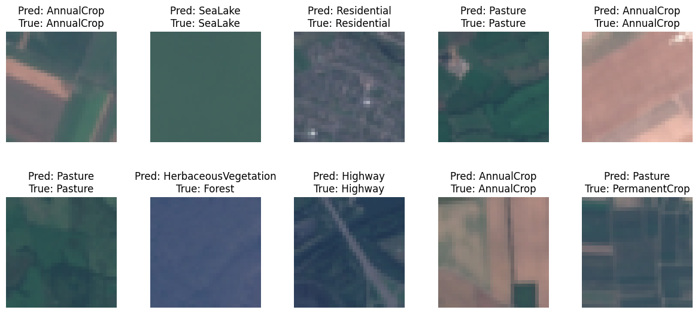
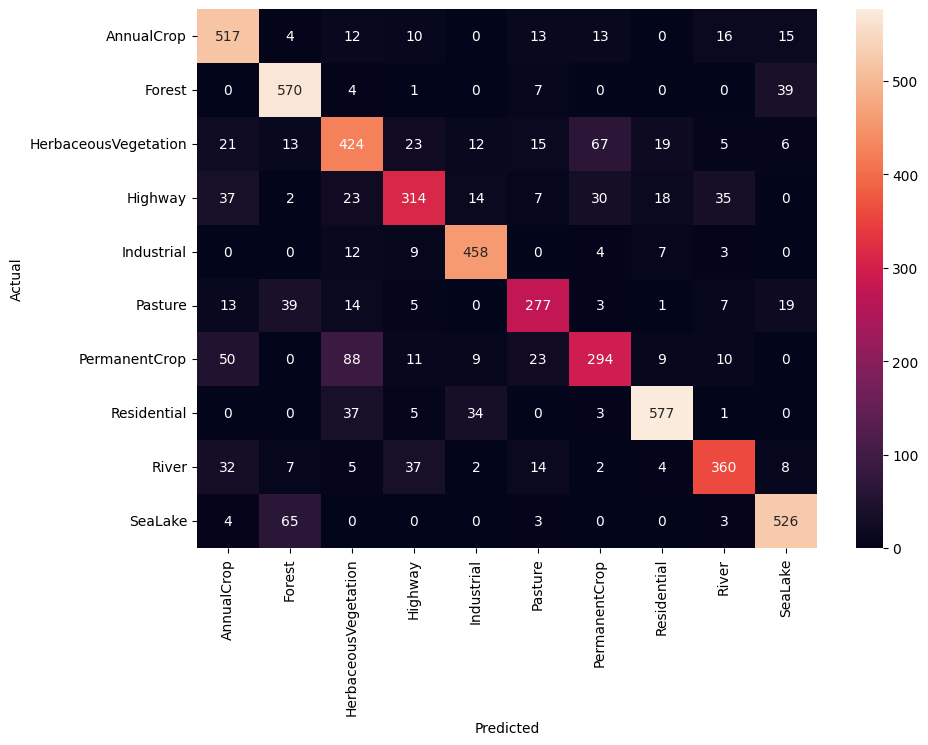

```{r setup, include=FALSE,warning = FALSE}
knitr::opts_chunk$set(echo = FALSE, warning = FALSE)
library(tidyverse)
library(ggplot2)
library(igraph)
library(arules)  # has a big ecosystem of packages built around it
library(arulesViz)
```

# Q1. Clustering and PCA
We're going to compare PCA and K-means clustering, focusing on which dimensionality reduction technique is more capable of distinguishing the color and quality of wine. We'll focus on two components and clusters to make it easy to compare using plot.

## 1. PCA
We run PCA with four principal components, which have about 73% of the cumulative variance. It means intuitively that these four components have about 73% information about the original data. 
```{r cars}
wine = read.csv('wine.csv')
# Center and scale the data
X = wine[,-(12:13)]
X = scale(X, center=TRUE, scale=TRUE)

pca_1 = prcomp(X, rank=4, scale=TRUE)
loadings = pca_1$rotation
scores = pca_1$x
summary(pca_1)
```

Also, we can find the loading of the component, and it reflects what the principal components are composed of.

```{r}
print(pca_1$rotation)
```

The first two components, which have the biggest variance, seem to distinguish the color of the wine well; they are almost separated; the right upper part of the black line represents white wine, and the left lower part seems to represent red wine.

```{r}
qplot(scores[,1], scores[,2], color=wine$color)+labs(x='Component 1', y='Component 2', title = 'Wine color distribution with principal component')+ geom_abline(slope = 3, intercept = 3.5)

```

However, it is hard to distinguish wine quality from the principal components. It doesn't show gradation, but various colors—that is, wines of different quality—are scattered around.

```{r}
qplot(scores[,1], scores[,2], color=wine$quality)+labs(x='Component 1', y='Component 2', title = 'Wine quality distribution with principal component')
```

## 2. K-means clustering
We checked some combinations of chemicals, and found that "total sulfur dioxide" and "fixed acidity" might be largely reflected to the clusters that we make. Even though we do not know what the clusters are, wines are well-distinguished by the clusters on the plot with this two chemicals.
The figure below represents that cluster 1 is mainly spread horizontally on x-axis, and cluster 2 is vertically situated.

```{r}

# Extract the centers and scales from the rescaled data (which are named attributes)
mu = attr(X,"scaled:center")
sigma = attr(X,"scaled:scale")
# Run k-means with 2 clusters and 25 starts
clust_1 = kmeans(X, 2, nstart = 25)

# total.sulfur.dioxide and fixed.acidity
ggplot(wine) + 
  geom_point(alpha = 0.5, aes(total.sulfur.dioxide, fixed.acidity, color = factor(clust_1$cluster)))+
  labs(x ="total.sulfur.dioxide", y ="fixed.acidity ", title = "Cluster distribution with total sulfur dioxide and fixed acidity ")+ geom_abline(slope = 0.08, intercept = 2.4)
```
According to the figure below, the color of wine is well-distinguished by these two clusters, and red is close to cluster 2 and white is similar to cluster 1. Therefore, it seems K-means clustering is capable of distinguishing the color of wine.

```{r pressure, echo=FALSE}
# total.sulfur.dioxide and fixed.acidity with wine color
ggplot(wine) + 
  geom_point(alpha = 0.5, aes(total.sulfur.dioxide, fixed.acidity, color = color , shape=factor(clust_1$cluster)))+
  labs(x ="total.sulfur.dioxide", y ="fixed.acidity sugar", title = "Distribution of wine color with cluster")+ geom_abline(slope = 0.08, intercept = 2.4)
```


The plot below shows the distribution of wine quality, and it is so difficult to find any direction of color change that it is hard to distinguish the quality of wine.

```{r}
ggplot(wine) + 
  geom_point(alpha = 0.7, aes(total.sulfur.dioxide, fixed.acidity, color = quality, shape=factor(clust_1$cluster)))+ 
  labs( title = "Distribution of wine quality with cluster")
```

As a result, PCA is better at distinguishing the color of wine since it separates wines more clearly and with less overlap than k-means clustering. However, k-means is not bad at separating, so we can guess that the color of wine is closely related to the chemicals in the data. On the other hand, both PCA and K-men clustering are not capable of distinguishing the quality of wine.

# Q2: Market segmentation
### Step 1: Data Preprocessing: 
We remove records flagged as "spam", "adult", or "uncategorized"

```{r}
library(tidyverse)
library(cluster)

# 1.1 r
data = read.csv('social_marketing.csv')
cleaned_data = data %>% 
  filter(spam == 0, adult == 0, uncategorized == 0)
# Now, directly drop the columns by subsetting
cleaned_data <- cleaned_data[, !(names(cleaned_data) %in% c("spam", "adult", "uncategorized", "Unnamed: 0"))]

# 1.2 scale the data
numeric_columns = sapply(cleaned_data, is.numeric)
numeric_data = cleaned_data[, numeric_columns]

# Apply the normalization (z-score normalization)
scaled_data = as.data.frame(lapply(numeric_data, function(x) {
  (x - mean(x, na.rm = TRUE)) / sd(x, na.rm = TRUE)
}))

# Check the structure of the scaled data
str(scaled_data)
```


### Step 2: 
Clustering - Perform a clustering analysis to identify distinct market segments, with K-means 
Determine the optimal number of clusters k using the Elbow method

```{r}

wss <- sapply(1:15, function(k) {
  kmeans(scaled_data, centers = k, nstart = 25)$tot.withinss
})

# Plot the Elbow method results to help determine the best k
plot(1:15, wss, type = "b", xlab = "Number of Clusters", ylab = "Total Within-Cluster Sum of Square")
 
```

In this plot, the elbow seems to be not very pronounced, but we can observe a subtle change in the slope after k=3.

```{r}
# Choose k based on the plot
k = 3 

# Perform K-means clustering with the chosen number of clusters
set.seed(123) # For reproducibility
kmeans_result <- kmeans(scaled_data, centers = k, nstart = 25)

# Examine the clustering result
#print(kmeans_result)

```

### Step 3:
Attach the cluster labels to the original data

```{r}

cleaned_data$cluster = kmeans_result$cluster

# Analyze the cluster centroids
centroids = kmeans_result$centers
#print(centroids)

# Profile and interpret clusters
aggregate(cleaned_data[, -ncol(cleaned_data)], by=list(cluster=cleaned_data$cluster), mean)

# Check the size of each cluster
#print(kmeans_result$size)

# Before Visualize clusters : use PCA
# Run PCA on the scaled data
pca_result <- prcomp(numeric_data, scale = TRUE)

# Add PCA scores for the first two principal components to your cleaned data
cleaned_data$PC1 <- pca_result$x[, 1]
cleaned_data$PC2 <- pca_result$x[, 2]

# Now create a ggplot using the first two principal components
ggplot(cleaned_data, aes(x=PC1, y=PC2, color=factor(cluster))) + 
  geom_point(alpha = 0.6) +  # alpha for transparency to see overlapping points
  scale_color_discrete(name="Cluster") +
  labs(x="Principal Component 1", y="Principal Component 2") +
  theme_minimal()
```


```{r}
# Cluster Interpretation
#print(kmeans_result) # Review the centroids for interpretability $centers

# Cluster Profiling (based on cluster means on original variables, not PCA)
cluster_profiles <- aggregate(cleaned_data[, -ncol(cleaned_data)], 
                              by=list(cluster=cleaned_data$cluster), mean)
print(cluster_profiles)

# Variable Importance (PCA Loadings)
loadings <- as.data.frame(pca_result$rotation)
#print(head(loadings[order(abs(loadings$PC1), decreasing = TRUE), ]))
#print(head(loadings[order(abs(loadings$PC2), decreasing = TRUE), ]))

```
The above output show the values associated with each of the centroids of each of the clusters. We used, this along with other evaluations of other points in the cluster and the analysis of what makes up principle components 1 and 2 to segment the market into these three market clusters described below.


### Step 4: 
Labeling Clusters - Market Segmentation

```{r, include=FALSE}

cluster_labels <- c("Community-Focused", "Health & Community Minded", "Active Lifestyle Enthusiasts")

factor(kmeans_result$cluster, labels = cluster_labels)

cluster_labels <- c("Community & Family-Focused", "Health Conscious", "")
names(cluster_labels) <- levels(factor(cleaned_data$cluster))
cleaned_data$cluster_label <- cluster_labels[cleaned_data$cluster]

# Review the assigned labels and profiles
#print(cleaned_data$cluster_label)

```

How they might position their brand to maximally appeal to each market segment: 

#### 1:Community-Focused Cluster:
Cluster 1 High on PC1, Low on PC2: This cluster would be characterized by users with strong community and family values who are less engaged in activities like sharing photos, cooking, or personal fitness. We chose to label this cluster "Community & Family-Focused." This segment values community and traditional activities. "NutrientH20" could position their brand as a traditional, family-friendly product. Marketing campaigns could feature family gatherings, communal events, and emphasize the brand’s role in nurturing these relationships. Sponsorships or partnerships with community organizations, faith-based groups, and local sports teams could also resonate well with this segment. AS this appears to be the majority of their consumers with 2126 consumers in it, it may be important to focus on these consumers.

### 2: Health-Conscious Cluster:
Cluster 2 is high on PC1, and high on PC2: These users appear to be interested in health and lifestyle as suggested by the positive values of "food" and "sports_fandom" and "family" on PC2.These individuals appear to value both their health and their community. NutrientH20 might focus on highlighting the health benefits of their drinks, such as hydration, natural ingredients, or fitness recovery aspects to indulge the sports fanatics. They could also show their brand as a supporter of community health initiatives, such as local sports events, wellness programs, or outdoor activities that promote a healthy lifestyle. However, this is the smallest of the clusters with only 365 members so maybe not the most important folkd to target.

### 3: Active Lifestyle Enthusiasts Cluster:
Cluster 3 is low on PC1 and high on PC2. These users focused on photo sharing and fitness. This group is engaged in modern lifestyle activities such as fitness and sharing their experiences online. NutrientH20 can showcase their product within the context of an active lifestyle, focusing on the convenience, design, and how the product fits into an on-the-go, wellness-oriented life. Collaborating with fitness influencers, participating in fitness challenges, and creating visually appealing content for social media that encourages sharing could appeal to this segment.

# Q3: Association rules for grocery purchases

```{r}
# (1) Load and Process the Data:
groceries = read.transactions('groceries.txt')

groceries_list = readLines('groceries.txt')
groceries_list = strsplit(groceries_list, ",")

# Remove duplicates ("de-dupe")
groceries_list_unique = lapply(groceries_list, unique)

# (2) Convert list to transactions
groceries_transactions <- as(groceries_list_unique, "transactions")

# Convert the cleaned list to transactions
# Cast this variable as a special arules "transactions" class.

```


```{r}
# (3) Apply the Apriori Algorithm
rules = apriori(groceries_transactions,
                 parameter = list(support = 0.005, confidence = 0.1, minlen = 4))
# Look at rules with support > .005 & confidence >.1 & length (#) <= 4

```

Thresholds for lift and confidence: A support threshold of 0.005 means we're interested in itemsets that appear in at least 0.5% of all transactions. This value is chosen to ensure that the rules are not based on very rare item combinations, which might be of less practical significance. It's low enough to capture infrequent but potentially interesting associations, yet high enough to ignore rules that could occur simply by chance due to very low occurrence.

A confidence threshold of 0.2 is chosen to ensure that at least 20% of the time, the items on the left-hand side of the rule are accompanied by the items on the right-hand side. This is a relatively low threshold for confidence, allowing for the discovery of rules that might not be very strong but could still provide interesting insights. Higher confidence levels could be used to focus on more reliable rules but might miss out on less obvious patterns.

Setting minlen to 2 ensures that the rules consist of at least two items. This is the smallest possible rule and ensures that you are looking at associations between items, not just the frequency of single items.

```{r}
# Analyze and Visualize the Results
# Basic plot of rules
plot(rules)

plot(rules, method = "graph", control = list(type = "items"))

# For more detailed exploration, inspect rules
inspect(head(sort(rules, by = "lift"), 10))

```

## Support and Confidence Levels:

### Graph 01: 
The scatter plot indicates that most rules have a support between 0.005 and 0.0075. This is consistent with the minimum support level defined, meaning we've captured the itemsets that appear in at least 0.5% of the transactions.

### Graph 02: 
The graph visualization clusters items like 'whole milk', 'yogurt', 'other vegetables', 'rolls/buns', and 'tropical fruit' with high lift values, suggesting that these combinations are more common than expected. This finding is logical as items such as 'whole milk' and 'bread' are staples in many households, and 'yogurt' often pairs with 'fruit' as a common breakfast or snack choice.The presence of 'whole milk' in several rules could signify it as a potential 'connector' item, which is frequently bought with various other items.

# Q4: Image classification with neural networks

The following figures are the output of the "ECO395MHomework4Q4" Jupyter Source File located in the same directory as this R Markdown file. The code uses a 80/20 train test split of the EuroSAT_RGB photographs, and using the color values in RGB notation, classifies each test photo into one of 11 categories (e.g. industrial, crops, rivers, forest, etc.). We had it run through 10 Epochs, or 10 runs through the whole set. We list below the neural network model with a learning rate of 0.001 and loss function output decreasing as we move through the Epochs.

SataliteNN
  (conv1): Conv2d(3, 16, kernel_size=(5, 5), stride=(1, 1))
  
  (pool): MaxPool2d(kernel_size=2, stride=2, padding=0, dilation=1, ceil_mode=False)
  
  (conv2): Conv2d(16, 32, kernel_size=(5, 5), stride=(1, 1))
  
  (fc1): Linear(in_features=800, out_features=120, bias=True)
  
  (fc2): Linear(in_features=120, out_features=84, bias=True)
  
  (fc3): Linear(in_features=84, out_features=10, bias=True)


Epoch 1, Loss: 1.2811198836427045

Epoch 2, Loss: 0.9210050483367026

Epoch 3, Loss: 0.8127668705654624

Epoch 4, Loss: 0.7332519596057978

Epoch 5, Loss: 0.6718016320998194

Epoch 6, Loss: 0.6176651422231548

Epoch 7, Loss: 0.5799342335957098

Epoch 8, Loss: 0.5500946855521976

Epoch 9, Loss: 0.5310325839008201

Epoch 10, Loss: 0.507780645660004

After this runs, we simply calculate the overall test-set accuracy of the network on test images by the number it got correct divided by the total number of images in the test set and got an out of sample accuracy of 79 %. Below are a few examples of the test set images after being rescaled.



We see that the the categories the model is the least accurate discerning are the vegetation and permanent cropland categories. We provide the confusion matrix below showing of the actual category pictures (y-axis), how many of those categories were predicted to be in each category (x-axis). The number in each box corresponds to the number of images in fouler its its row that it predicted it should be in the fouler name of its column. We see that by far most pictures are accurately placed in the correct category solely based on the RGB values of a scaled version of the picture. This example provides evidence for the robustness of the neural network as a model to make predictions.


