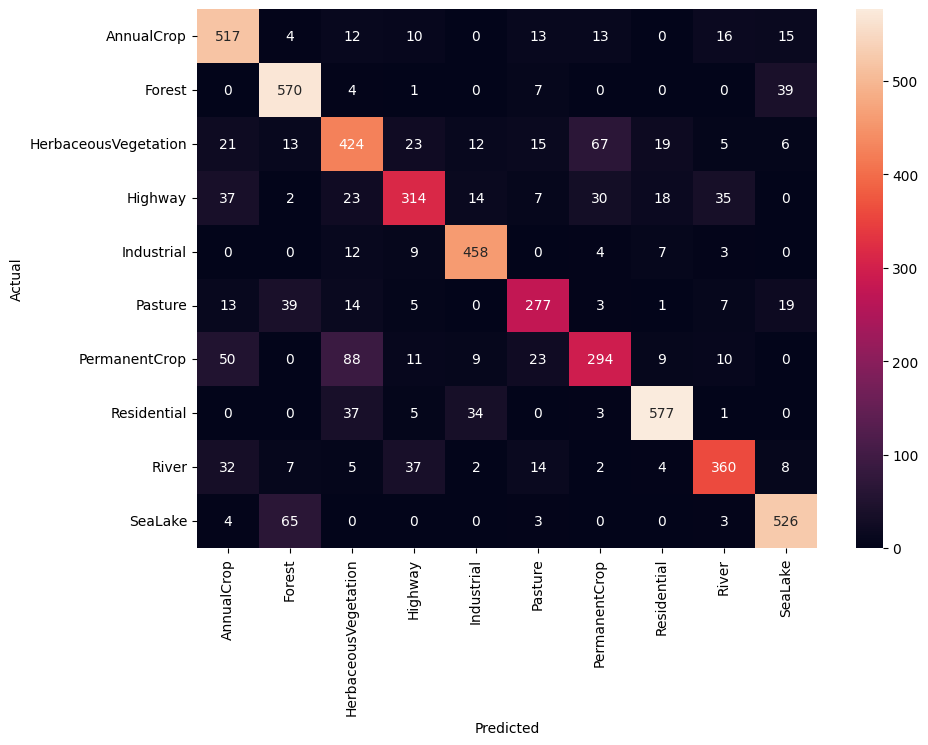

# Q1. Clustering and PCA

We’re going to compare PCA and K-means clustering, focusing on which
dimensionality reduction technique is more capable of distinguishing the
color and quality of wine. We’ll focus on two components and clusters to
make it easy to compare using plot.

## 1. PCA

We run PCA with four principal components, which have about 73% of the
cumulative variance. It means intuitively that these four components
have about 73% information about the original data.

    ## Importance of first k=4 (out of 11) components:
    ##                           PC1    PC2    PC3     PC4
    ## Standard deviation     1.7407 1.5792 1.2475 0.98517
    ## Proportion of Variance 0.2754 0.2267 0.1415 0.08823
    ## Cumulative Proportion  0.2754 0.5021 0.6436 0.73187

Also, we can find the loading of the component, and it reflects what the
principal components are composed of.

    ##                              PC1         PC2         PC3         PC4
    ## fixed.acidity        -0.23879890  0.33635454 -0.43430130  0.16434621
    ## volatile.acidity     -0.38075750  0.11754972  0.30725942  0.21278489
    ## citric.acid           0.15238844  0.18329940 -0.59056967 -0.26430031
    ## residual.sugar        0.34591993  0.32991418  0.16468843  0.16744301
    ## chlorides            -0.29011259  0.31525799  0.01667910 -0.24474386
    ## free.sulfur.dioxide   0.43091401  0.07193260  0.13422395 -0.35727894
    ## total.sulfur.dioxide  0.48741806  0.08726628  0.10746230 -0.20842014
    ## density              -0.04493664  0.58403734  0.17560555  0.07272496
    ## pH                   -0.21868644 -0.15586900  0.45532412 -0.41455110
    ## sulphates            -0.29413517  0.19171577 -0.07004248 -0.64053571
    ## alcohol              -0.10643712 -0.46505769 -0.26110053 -0.10680270

The first two components, which have the biggest variance, seem to
distinguish the color of the wine well; they are almost separated; the
right upper part of the black line represents white wine, and the left
lower part seems to represent red wine.

However, it is hard to distinguish wine quality from the principal
components. It doesn’t show gradation, but various colors—that is, wines
of different quality—are scattered around.

## 2. K-means clustering

We checked some combinations of chemicals, and found that “total sulfur
dioxide” and “fixed acidity” might be largely reflected to the clusters
that we make. Even though we do not know what the clusters are, wines
are well-distinguished by the clusters on the plot with this two
chemicals. The figure below represents that cluster 1 is mainly spread
horizontally on x-axis, and cluster 2 is vertically situated.

According to the figure below, the color of wine is well-distinguished
by these two clusters, and red is close to cluster 2 and white is
similar to cluster 1. Therefore, it seems K-means clustering is capable
of distinguishing the color of wine.

The plot below shows the distribution of wine quality, and it is so
difficult to find any direction of color change that it is hard to
distinguish the quality of wine.

As a result, PCA is better at distinguishing the color of wine since it
separates wines more clearly and with less overlap than k-means
clustering. However, k-means is not bad at separating, so we can guess
that the color of wine is closely related to the chemicals in the data.
On the other hand, both PCA and K-men clustering are not capable of
distinguishing the quality of wine.

# Q2: Market segmentation

### Step 1: Data Preprocessing:

We remove records flagged as “spam”, “adult”, or “uncategorized”

    ## 'data.frame':    3331 obs. of  33 variables:
    ##  $ chatter         : num  -0.929 0.541 -0.929 0.541 0.247 ...
    ##  $ current_events  : num  2.783 1.989 0.401 0.401 0.401 ...
    ##  $ travel          : num  0.221 0.221 2.458 -0.673 1.116 ...
    ##  $ photo_sharing   : num  -0.184 1.788 -0.578 -0.578 0.605 ...
    ##  $ tv_film         : num  0.066 0.066 0.066 -0.645 2.911 ...
    ##  $ sports_fandom   : num  -0.741 -0.279 -0.279 -0.741 3.421 ...
    ##  $ politics        : num  -0.279 -0.604 2.971 -0.604 -0.279 ...
    ##  $ food            : num  -0.762 0.375 -0.193 0.375 2.08 ...
    ##  $ family          : num  0.118 0.118 -0.768 1.003 2.775 ...
    ##  $ home_and_garden : num  -0.68 0.737 -0.68 0.737 -0.68 ...
    ##  $ music           : num  -0.664 0.46 -0.664 0.46 0.46 ...
    ##  $ news            : num  -0.571 -0.571 -0.103 -0.571 -0.571 ...
    ##  $ online_gaming   : num  -0.4562 -0.4562 -0.4562 0.34 -0.0581 ...
    ##  $ shopping        : num  -0.752 2.131 -0.176 -0.752 -0.752 ...
    ##  $ health_nutrition: num  -0.55 -0.55 -0.312 4.684 1.116 ...
    ##  $ college_uni     : num  -0.138 -0.513 -0.138 -0.138 0.987 ...
    ##  $ sports_playing  : num  -0.643 -0.643 0.446 -0.643 0.446 ...
    ##  $ cooking         : num  -0.588 -0.588 -0.216 1.269 0.898 ...
    ##  $ eco             : num  -0.636 -0.636 -0.636 2.085 0.724 ...
    ##  $ computers       : num  -0.542 0.322 0.322 0.322 1.186 ...
    ##  $ business        : num  0.949 0.949 4.034 0.949 -0.594 ...
    ##  $ outdoors        : num  -0.635 -0.635 0.282 2.115 -0.635 ...
    ##  $ crafts          : num  3.277 -0.595 -0.595 -0.595 -0.595 ...
    ##  $ automotive      : num  -0.596 0.13 -0.596 -0.596 2.311 ...
    ##  $ art             : num  1.035 -0.44 0.297 0.297 -0.44 ...
    ##  $ religion        : num  -0.5592 -0.5592 -0.0324 -0.5592 6.2889 ...
    ##  $ beauty          : num  0.402 -0.515 -0.515 4.069 0.402 ...
    ##  $ parenting       : num  -0.606 -0.606 -0.606 -0.606 1.381 ...
    ##  $ dating          : num  -0.439 -0.439 -0.439 -0.439 -0.439 ...
    ##  $ school          : num  -0.607 -0.607 -0.607 0.248 1.958 ...
    ##  $ personal_fitness: num  -0.591 -0.591 -0.591 4.814 0.31 ...
    ##  $ fashion         : num  -0.529 -0.529 -0.529 1.467 0.136 ...
    ##  $ small_business  : num  -0.515 -0.515 -0.515 1.26 -0.515 ...

### Step 2:

Clustering - Perform a clustering analysis to identify distinct market
segments, with K-means Determine the optimal number of clusters k using
the Elbow method

In this plot, the elbow seems to be not very pronounced, but we can
observe a subtle change in the slope after k=3.

### Step 3:

Attach the cluster labels to the original data

    ##   cluster  X  chatter current_events   travel photo_sharing   tv_film
    ## 1       1 NA 3.449200       1.334431 1.161336      1.788335 0.7220132
    ## 2       2 NA 3.649315       1.649315 1.441096      2.290411 0.8904110
    ## 3       3 NA 6.178571       1.836905 2.402381      4.254762 1.3833333
    ##   sports_fandom politics      food    family home_and_garden     music
    ## 1     0.9962371 1.347131 0.7539981 0.5620884       0.3833490 0.4355597
    ## 2     5.6657534 1.358904 4.4684932 2.4246575       0.6356164 0.6739726
    ## 3     1.3726190 3.367857 1.4642857 0.9630952       0.6559524 0.9464286
    ##        news online_gaming  shopping health_nutrition college_uni sports_playing
    ## 1 0.8809972      0.911571 0.9238006         1.337723    1.079962      0.4524929
    ## 2 1.0931507      1.230137 1.1479452         1.704110    1.328767      0.7287671
    ## 3 2.1297619      1.702381 2.3357143         5.035714    2.113095      0.8797619
    ##     cooking       eco computers  business  outdoors    crafts automotive
    ## 1 0.8170273 0.3113829 0.3904045 0.2681091 0.4468485 0.2963311  0.6175917
    ## 2 1.4410959 0.5068493 0.8164384 0.4876712 0.6630137 1.0082192  0.9808219
    ## 3 3.5821429 0.8464286 1.1440476 0.6369048 1.3261905 0.6392857  1.2642857
    ##         art  religion    beauty parenting    dating    school personal_fitness
    ## 1 0.3998119 0.4731891 0.2925682 0.4581373 0.3443086 0.3537159        0.7610536
    ## 2 0.7123288 5.1150685 0.9972603 3.9452055 0.6465753 2.6712329        1.0410959
    ## 3 1.0452381 0.7892857 1.0535714 0.7535714 0.9154762 0.7595238        2.8250000
    ##     fashion small_business
    ## 1 0.4294450      0.1975541
    ## 2 0.9424658      0.3671233
    ## 3 1.6559524      0.4904762

    ##   cluster  X  chatter current_events   travel photo_sharing   tv_film
    ## 1       1 NA 3.449200       1.334431 1.161336      1.788335 0.7220132
    ## 2       2 NA 3.649315       1.649315 1.441096      2.290411 0.8904110
    ## 3       3 NA 6.178571       1.836905 2.402381      4.254762 1.3833333
    ##   sports_fandom politics      food    family home_and_garden     music
    ## 1     0.9962371 1.347131 0.7539981 0.5620884       0.3833490 0.4355597
    ## 2     5.6657534 1.358904 4.4684932 2.4246575       0.6356164 0.6739726
    ## 3     1.3726190 3.367857 1.4642857 0.9630952       0.6559524 0.9464286
    ##        news online_gaming  shopping health_nutrition college_uni sports_playing
    ## 1 0.8809972      0.911571 0.9238006         1.337723    1.079962      0.4524929
    ## 2 1.0931507      1.230137 1.1479452         1.704110    1.328767      0.7287671
    ## 3 2.1297619      1.702381 2.3357143         5.035714    2.113095      0.8797619
    ##     cooking       eco computers  business  outdoors    crafts automotive
    ## 1 0.8170273 0.3113829 0.3904045 0.2681091 0.4468485 0.2963311  0.6175917
    ## 2 1.4410959 0.5068493 0.8164384 0.4876712 0.6630137 1.0082192  0.9808219
    ## 3 3.5821429 0.8464286 1.1440476 0.6369048 1.3261905 0.6392857  1.2642857
    ##         art  religion    beauty parenting    dating    school personal_fitness
    ## 1 0.3998119 0.4731891 0.2925682 0.4581373 0.3443086 0.3537159        0.7610536
    ## 2 0.7123288 5.1150685 0.9972603 3.9452055 0.6465753 2.6712329        1.0410959
    ## 3 1.0452381 0.7892857 1.0535714 0.7535714 0.9154762 0.7595238        2.8250000
    ##     fashion small_business cluster       PC1
    ## 1 0.4294450      0.1975541       1 -1.199759
    ## 2 0.9424658      0.3671233       2  3.624491
    ## 3 1.6559524      0.4904762       3  1.461604

The above output show the values associated with each of the centroids
of each of the clusters. We used, this along with other evaluations of
other points in the cluster and the analysis of what makes up principle
components 1 and 2 to segment the market into these three market
clusters described below.

### Step 4:

Labeling Clusters - Market Segmentation

How they might position their brand to maximally appeal to each market
segment:

#### 1:Community-Focused Cluster:

Cluster 1 High on PC1, Low on PC2: This cluster would be characterized
by users with strong community and family values who are less engaged in
activities like sharing photos, cooking, or personal fitness. We chose
to label this cluster “Community & Family-Focused.” This segment values
community and traditional activities. “NutrientH20” could position their
brand as a traditional, family-friendly product. Marketing campaigns
could feature family gatherings, communal events, and emphasize the
brand’s role in nurturing these relationships. Sponsorships or
partnerships with community organizations, faith-based groups, and local
sports teams could also resonate well with this segment. AS this appears
to be the majority of their consumers with 2126 consumers in it, it may
be important to focus on these consumers.

### 2: Health-Conscious Cluster:

Cluster 2 is high on PC1, and high on PC2: These users appear to be
interested in health and lifestyle as suggested by the positive values
of “food” and “sports\_fandom” and “family” on PC2.These individuals
appear to value both their health and their community. NutrientH20 might
focus on highlighting the health benefits of their drinks, such as
hydration, natural ingredients, or fitness recovery aspects to indulge
the sports fanatics. They could also show their brand as a supporter of
community health initiatives, such as local sports events, wellness
programs, or outdoor activities that promote a healthy lifestyle.
However, this is the smallest of the clusters with only 365 members so
maybe not the most important folkd to target.

### 3: Active Lifestyle Enthusiasts Cluster:

Cluster 3 is low on PC1 and high on PC2. These users focused on photo
sharing and fitness. This group is engaged in modern lifestyle
activities such as fitness and sharing their experiences online.
NutrientH20 can showcase their product within the context of an active
lifestyle, focusing on the convenience, design, and how the product fits
into an on-the-go, wellness-oriented life. Collaborating with fitness
influencers, participating in fitness challenges, and creating visually
appealing content for social media that encourages sharing could appeal
to this segment.

# Q3: Association rules for grocery purchases

    ## Apriori
    ## 
    ## Parameter specification:
    ##  confidence minval smax arem  aval originalSupport maxtime support minlen
    ##         0.1    0.1    1 none FALSE            TRUE       5   0.005      4
    ##  maxlen target  ext
    ##      10  rules TRUE
    ## 
    ## Algorithmic control:
    ##  filter tree heap memopt load sort verbose
    ##     0.1 TRUE TRUE  FALSE TRUE    2    TRUE
    ## 
    ## Absolute minimum support count: 49 
    ## 
    ## set item appearances ...[0 item(s)] done [0.00s].
    ## set transactions ...[169 item(s), 9835 transaction(s)] done [0.00s].
    ## sorting and recoding items ... [120 item(s)] done [0.00s].
    ## creating transaction tree ... done [0.00s].
    ## checking subsets of size 1 2 3 4 done [0.00s].
    ## writing ... [48 rule(s)] done [0.00s].
    ## creating S4 object  ... done [0.00s].

Thresholds for lift and confidence: A support threshold of 0.005 means
we’re interested in itemsets that appear in at least 0.5% of all
transactions. This value is chosen to ensure that the rules are not
based on very rare item combinations, which might be of less practical
significance. It’s low enough to capture infrequent but potentially
interesting associations, yet high enough to ignore rules that could
occur simply by chance due to very low occurrence.

A confidence threshold of 0.2 is chosen to ensure that at least 20% of
the time, the items on the left-hand side of the rule are accompanied by
the items on the right-hand side. This is a relatively low threshold for
confidence, allowing for the discovery of rules that might not be very
strong but could still provide interesting insights. Higher confidence
levels could be used to focus on more reliable rules but might miss out
on less obvious patterns.

Setting minlen to 2 ensures that the rules consist of at least two
items. This is the smallest possible rule and ensures that you are
looking at associations between items, not just the frequency of single
items.

    ## To reduce overplotting, jitter is added! Use jitter = 0 to prevent jitter.

    ## Available control parameters (with default values):
    ## layout    =  stress
    ## circular  =  FALSE
    ## ggraphdots    =  NULL
    ## edges     =  <environment>
    ## nodes     =  <environment>
    ## nodetext  =  <environment>
    ## colors    =  c("#EE0000FF", "#EEEEEEFF")
    ## engine    =  ggplot2
    ## max   =  100
    ## verbose   =  FALSE

    ##      lhs                         rhs                      support confidence    coverage     lift count
    ## [1]  {citrus fruit,                                                                                    
    ##       other vegetables,                                                                                
    ##       whole milk}             => {root vegetables}    0.005795628  0.4453125 0.013014743 4.085493    57
    ## [2]  {other vegetables,                                                                                
    ##       tropical fruit,                                                                                  
    ##       whole milk}             => {root vegetables}    0.007015760  0.4107143 0.017081851 3.768074    69
    ## [3]  {root vegetables,                                                                                 
    ##       whole milk,                                                                                      
    ##       yogurt}                 => {tropical fruit}     0.005693950  0.3916084 0.014539908 3.732043    56
    ## [4]  {other vegetables,                                                                                
    ##       pip fruit,                                                                                       
    ##       whole milk}             => {root vegetables}    0.005490595  0.4060150 0.013523132 3.724961    54
    ## [5]  {other vegetables,                                                                                
    ##       whole milk,                                                                                      
    ##       yogurt}                 => {whipped/sour cream} 0.005592272  0.2511416 0.022267412 3.503514    55
    ## [6]  {fruit/vegetable juice,                                                                           
    ##       other vegetables,                                                                                
    ##       whole milk}             => {yogurt}             0.005083884  0.4854369 0.010472801 3.479790    50
    ## [7]  {tropical fruit,                                                                                  
    ##       whole milk,                                                                                      
    ##       yogurt}                 => {root vegetables}    0.005693950  0.3758389 0.015149975 3.448112    56
    ## [8]  {root vegetables,                                                                                 
    ##       tropical fruit,                                                                                  
    ##       whole milk}             => {yogurt}             0.005693950  0.4745763 0.011997966 3.401937    56
    ## [9]  {citrus fruit,                                                                                    
    ##       root vegetables,                                                                                 
    ##       whole milk}             => {other vegetables}   0.005795628  0.6333333 0.009150991 3.273165    57
    ## [10] {other vegetables,                                                                                
    ##       whole milk,                                                                                      
    ##       yogurt}                 => {tropical fruit}     0.007625826  0.3424658 0.022267412 3.263712    75

## Support and Confidence Levels:

### Graph 01:

The scatter plot indicates that most rules have a support between 0.005
and 0.0075. This is consistent with the minimum support level defined,
meaning we’ve captured the itemsets that appear in at least 0.5% of the
transactions.

### Graph 02:

The graph visualization clusters items like ‘whole milk’, ‘yogurt’,
‘other vegetables’, ‘rolls/buns’, and ‘tropical fruit’ with high lift
values, suggesting that these combinations are more common than
expected. This finding is logical as items such as ‘whole milk’ and
‘bread’ are staples in many households, and ‘yogurt’ often pairs with
‘fruit’ as a common breakfast or snack choice.The presence of ‘whole
milk’ in several rules could signify it as a potential ‘connector’ item,
which is frequently bought with various other items.

# Q4: Image classification with neural networks

The following figures are the output of the “ECO395MHomework4Q4” Jupyter
Source File located in the same directory as this R Markdown file. The
code uses a 80/20 train test split of the EuroSAT\_RGB photographs, and
using the color values in RGB notation, classifies each test photo into
one of 11 categories (e.g. industrial, crops, rivers, forest, etc.). We
had it run through 10 Epochs, or 10 runs through the whole set. We list
below the neural network model with a learning rate of 0.001 and loss
function output decreasing as we move through the Epochs.

SataliteNN (conv1): Conv2d(3, 16, kernel\_size=(5, 5), stride=(1, 1))

(pool): MaxPool2d(kernel\_size=2, stride=2, padding=0, dilation=1,
ceil\_mode=False)

(conv2): Conv2d(16, 32, kernel\_size=(5, 5), stride=(1, 1))

(fc1): Linear(in\_features=800, out\_features=120, bias=True)

(fc2): Linear(in\_features=120, out\_features=84, bias=True)

(fc3): Linear(in\_features=84, out\_features=10, bias=True)

Epoch 1, Loss: 1.2811198836427045

Epoch 2, Loss: 0.9210050483367026

Epoch 3, Loss: 0.8127668705654624

Epoch 4, Loss: 0.7332519596057978

Epoch 5, Loss: 0.6718016320998194

Epoch 6, Loss: 0.6176651422231548

Epoch 7, Loss: 0.5799342335957098

Epoch 8, Loss: 0.5500946855521976

Epoch 9, Loss: 0.5310325839008201

Epoch 10, Loss: 0.507780645660004

After this runs, we simply calculate the overall test-set accuracy of
the network on test images by the number it got correct divided by the
total number of images in the test set and got an out of sample accuracy
of 79 %. Below are a few examples of the test set images after being
rescaled.

<figure>

<figcaption aria-hidden="true">Sample Predictions</figcaption>
</figure>

We see that the the categories the model is the least accurate
discerning are the vegetation and permanent cropland categories. We
provide the confusion matrix below showing of the actual category
pictures (y-axis), how many of those categories were predicted to be in
each category (x-axis). The number in each box corresponds to the number
of images in fouler its its row that it predicted it should be in the
fouler name of its column. We see that by far most pictures are
accurately placed in the correct category solely based on the RGB values
of a scaled version of the picture. This example provides evidence for
the robustness of the neural network as a model to make predictions.

<figure>

<figcaption aria-hidden="true">Confusion Matrix</figcaption>
</figure>
