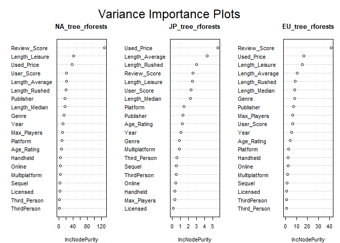
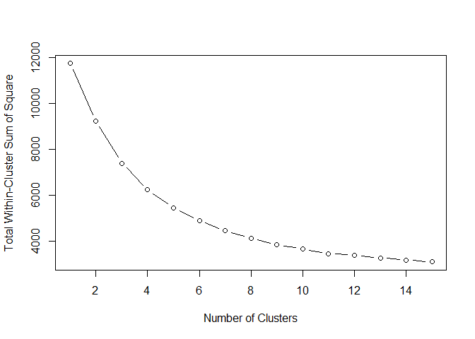

# Abstract

This report examines the gaming industry during the period 2004 to 2008,
before microtransactions and add-ons became prevalent, focusing on
finding the predictive factors for geographic game sales in North
America, Japan and the European Union. To do this, unsupervised and
supervised machine learning techniques were employed, including
principle component analysis, classification and regression trees,
random forests, gradient boosted trees, and lasso regression paths. The
report identifies four distinct market segments with unique sales
patterns, user engagement and market reach: Family Friendly
Blockbusters, Industry Average & Low Performers, AAA Series Staples, and
Niche Enthusiasts. The findings from the predictive models suggest that
games offering both quick completion and an extended leisure play meet
these diverse consumer demands. These observations, along with the
regional preferences shown in the lasso regression models provide
insight into consumer behavior that supports the shift to a more
flexible pricing model in the games industry that maximizes both player
enjoyment and revenue generation.

# Introduction

     In 1971, the first commercial video game “Computer Space” was
released in what would now be called an arcade cabinet. Today, less than
55 years later, the gaming industry has grown to become the highest
grossing entertainment industry in the world \[1\]. It now surpasses the
gross revenues of the movie and music industries combined as well as
that of most printed media \[2\]. Today, anyone can participate in the
gaming industry, also known as the interactive entertainment industry,
by being what is called an indie or an independent developer. Presently,
there are many different ways of pricing a game, whether that’s free to
play, play to earn, subscription-based, or live service. Additionally,
many games provide downloadable content (or DLC) as well as in-game
microtransactions where a gamer can pay more money to have a longer or
more rich game experience with additional content. Those who paid for
the base game, but did not pay these additional fees, now get a slightly
shorter and/or different play experience. These aforementioned
microtransactions initially gained traction in April of 2006. The
release of The Elder Scrolls 4: Oblivion’s first set of expansion
content provided for a new source of revenue for the game developers
\[3\]. What this report seeks to find in the two year leading up to this
release and the two years after, is evidence for why this change in
pricing structure is observed today. by analyzing the time in the gaming
industry when additional game content was not behind a pay wall as it is
today and this transition period when that first began to change.

       This report will be analyzing the sales of games that follow the
prevalent model throughout the industry’s history, called the premium
model. In the premium model, players are charged a flat positive price
for the game, and after paying that price, they have access to the full
game for the product’s lifetime. This is the same pricing most physical
products bought at a store would have. This analysis seeks to find the
strongest predictive model for how well a premium-model console game
would sell in North America and other regions of the world based on data
available from 2004 to 2008. The game consoles released at that time and
the basis for this report’s analysis are the Nintendo Wii, Nintendo DS,
Microsoft’s Xbox 360, and Sony’s PS3 and PSP. In finding these
predictive models, the report focuses on whether the length of the game,
either rushed, leisurely played, or the time to beat on average,
according to <https://howlongtobeat.com/> is predictive of game sales.
The question at the center of this report is whether or not there is
predictive evidence to suggest that making a game shorter and allowing
consumers to pay for a longer experience could benefit the gaming
industry. In other words, was there a case for interactive entertainment
companies to restrict game content and charge additional prices for
those who want a longer game. This question is analyzed using
unsupervised and supervised machine learning including principle
component analysis (PCA), variable importance plots, partial dependence
plots, tree models, and regression paths.

# Methods

       The data set that will be analyzed is a merge of three data sets.
The first dataset can be found on
<https://www.kaggle.com/datasets/sidtwr/videogames-sales-dataset/data>
\[4\]. It lists 16,720 game releases for 11,563 different games that
were released on Consoles or on PCs. Each release/observation sold at
least 10,000 copies between 1980 and December 22nd 2016 which is much of
the industry’s history. Due to the nature of the data set, the games
listed do not include mobile games, and most if not all of the games
listed follow the premium pricing model mentioned in the
introduction.The data set has 7 categorical variables and 10 continuous
variables. The columns used in this report are the platform, genre,
publisher, sales, and review data.

       The 2nd data set this report is using comes from Dr. Joe Cox at
the University of Portsmouth \[5\]. The data set was compiled for a
paper he wrote on what makes a blockbuster video game. The variables of
interest used from this data set are the dummy variables listed below as
well as the used sales prices of these titles.

       The 3rd data set used in this analysis is from Dr. Austin Cory
Bart at the University of Delaware when he was a PhD student at Virginia
Tech \[6\]. His data set was compiled from using Joe Cox’s data in
addition to a scrape of HowLongToBeat.com. The variables of interest
from this set were the length variables and the max players.

These three data sets were merged by the games name and by platform so
that every release between 2004 and 2008 had the following variables:

### Categorical Variables:

Name: The name of the game

Platform: what platform was the game released on (PSP, PS3, Xbox360,
Wii, DS)

Max\_Players: The number of people who can play the game on the same
system at once

Genre: the genre of the game (Strategy, Action, etc.)

Publisher: the publishing studio of the game (Activision, Nintendo,
etc.)

Age\_Rating: (E for Everyone, M for mature audiences, etc.) provided by
the ESRB

Year: The year the game was released (2004 to 2008)

### “Continious” Variables

Review\_Score: average critics score on <https://www.metacritic.com/>
(1 - 100)

Used\_Price: the average resale price of the game

NA\_Sales: sales in North America in millions

EU\_Sales: sales in the European Union in millions

JP\_Sales: sales in Japan in millions

Other\_Sales: sales in the rest of the world in millions

Global\_scales: total sales in millions

User\_Score: average user score on <https://www.metacritic.com/> (1 -
10)

User\_Count: number of users in the average score

##### “Continious” Variables from <https://howlongtobeat.com/>

$\\$ $\\$ which defines playstyles as Length\_Median: median time to
beat the game in hours for all playstyles

Length\_Average: average time to beat the game in hours for all
playstyles

Length\_Leisure: time to beat the game in hours if played leisurely (all
playstyles)

Length\_Rushed: time to beat the game in hours if rushed through (all
playstyles)

Length\_Polled: number of people polled for all playstyles on
HowLongToBeat.com

### Dummy Variables

Sequel: 1 if the game is a sequel to another game, 0 otherwise

Online: 1 if the game connects to the internet, 0 otherwise

Licensed: 1 if it a licensed IP (e.g. NBA, etc), 0 otherwise

Handheld: 1 if the game is released on one of the 2 handheld concolses
(DS, PSP)

Multiplatform: 1 if the game is on multiple consoles, 0 otherwise

Third\_Person: 1 if the camera is not in the eyes of the playable
character, 0 otherwise

The statistical analysis begins with a unsupervised machine learning
approach using principal component analysis to see if the data can
segment the gaming market into discernible groups naturally. The PCAs
will be based on the length, sales and review variables. An interesting
outcome of this is would be to see if any clusters emerge that can be
identified and named based on popular discussions of the gaming
industry. As a major part of this report is to see if the length of a
game can help predict sales, attention will be put to the cluster
sorting of the long games.

After the clusters are formed and classified, the report moves on to
predictive modeling of game sales in the respective geographic regions:
North America, Japan, and the European Union. The models used are
classification and regression trees (CART), random forests, and gradient
boosted trees. Each will be tested using the same 80/20 train-test-split
and the out-of-sample root mean squared error (RMSE) will be calculated
and compared to help discern what model is the better predictor for
sales in the respective region. What’s most interesting for this
analysis is what variables are most predictive of sales, in particular
how length predicts sales. For this, the output presented in the results
section include the North American large CART model, the variance
importance plots of the random forest models of all three regions, and
partial dependence plots of leisure, rushed, and average length
time-to-beat on game sales from the gradient boosted trees.

Lastly, the third section of the report uses a lasso regression to again
estimate the most predictive variables for sales in the three geographic
regions. By reducing the penalty to the model, the results find the
first 10 variables that switch to having non-zero coefficients.

# Results

## Part 1: Principal Component Analysis

In clustering, the elbow method results were used to help determine the
best numer of cluster (k), as shown in appendix A. The elbow seems to be
not very pronounced, but a subtle change can be observed in the slope
after k=4. For this reason, the modeling will make for 4 clusters in the
PCA.

After the data is de-meaned and scaled, the cluster labels are attached
to the original data. The following values represent the variable
representations of the centroids of each of the four clusters in terms
of standard deviations. These clusters are then plotted and graphically
shown below using the first two principle components along with the size
of each cluster above the plot.

    ##   Review_Score Used_Price Length_Average Length_Leisure Length_Median
    ## 1    0.7821945  1.5813627   -0.154807941     -0.1257322   -0.24921609
    ## 2   -0.1328851 -0.1398689   -0.250403605     -0.2458172   -0.25234586
    ## 3    1.3513584  1.2781319    0.006707539      0.6770543    0.04627033
    ## 4    0.5026896  0.5381867    2.372644951      1.9870138    2.37889146
    ##   Length_Polled Length_Rushed    NA_Sales    EU_Sales   JP_Sales Other_Sales
    ## 1    0.01410217    -0.3179870  8.47110056  9.47989605  8.1239710   8.5565310
    ## 2   -0.16827244    -0.2458480 -0.16840785 -0.15432582 -0.1428825  -0.1677067
    ## 3    2.92462082    -0.1042757  1.83825752  1.44535576  0.4665720   1.8174774
    ## 4    0.10382492     2.3997186 -0.05874102 -0.07766034  0.4252230  -0.0620407
    ##   Global_Sales  User_Score   User_Count Third_Person
    ## 1  9.317755565  0.57010194  0.462445904  0.185096349
    ## 2 -0.170139578 -0.08303287 -0.181345019 -0.006413727
    ## 3  1.596428153  0.65056580  3.279482588 -0.136971298
    ## 4  0.008670002  0.40550768  0.009367803  0.114332190

    ## [1]   6 670  36  71

The values associated with each of the centroids of each of the
clusters, along with other evaluations of other points in the clusters,
and the analysis of what makes up principle components 1 and 2 are used
to segment the market into four market clusters described in the
conclusion. The 6 games in cluster 1 were found to be outliers in terms
of sales for geographic areas and will be excluded from the data moving
forward for the predictive modeling and lasso regressions. After
removing these six titles, User\_Count becomes the most predictive of
sales in most countries, which may be particularly obvious, as the more
people have the game, the more people there are to review it, so
User\_Count and Length\_Polled will be removed from the data set for the
remaining parts as well.

# Part 2: Predictive Tree Modeling for Sales

To examine predictive evidence of game length on sales, the model
predicts geographic game sales in absolute terms (not log terms). We
split the data into a training set that accounts for 80% of the releases
and a testing set that is the remaining 20% of the observations. The
models calculate their predictions on the testing set for the CART,
random forest, and gradient-boosted trees and compare the out-of-sample
RMSE and find that the gradient boosted tree has the smallest out of
sample RMSE in predicting game sales in Europe and Japan and the random
forest is the best predictor for North America.

## 1: CART

We begin with the CART model that predicts sales in North America. For
brevity in the results section, the CART models for Japan and Europe are
provided in Appendix B. The full tree below includes all numerical
variables in the data set. We have the tree set so the smallest split
has at least 10 observations.

When the tree is pruned at the 1 standard error complexity level, the
tree becomes too simple to be of any use of explanation. For Japan, the
tree is just the average game sales of all games, suggesting that Japan
has a low variability in game sales in the first place. In Europe the
tree is only the first split where the review score is above or below
93. For North America, the smaller tree is its first 2 splits, if the
review score if above or below 93, then if below 93, if it’s above or
below 85. This is the application of the 1SE rule to pick a tree that is
simple but whose performance is not discernibly different from the best
performing model. As all pruned trees are simply described here, they
are not pictured here.

Although the pruned tree is a much simpler tree than the larger ones,
the tree\_cart\_big is the best cart model compared to pruned one both
for learnin the predictive variables and preformance. Thus, the big
trees will be used in our comparisons as the RMSE for the large tree
cart pictured is less than that of the CART pruned by 1 standard error.

## 2: Random Forest

Next, we provide some information on our random forest prediction
results. Random forests are effective, fast and require little or no
tuning via CV, and we found that the default settings do well for
predictions. The variable importance plot showing when we leave out a
variable, how much does that increase mean squared error is represented
below for each of the three geographic regions.

Here the largest increase in mean squared error would be achieved if the
review score for North America and Europe and the used price for Japan
were left out of the respective models. Additionally it can be seen that
the predictive strength of the review score is potentially stronger
relative to the other variables for North America and Europe than the
used price is for Japan. The variable importance plot is made using the
training data but the RMSE was calculated using the testing data is is
shown below the next section about the gradient boosted tree.

## 3: Gradient-Boosted Tree

Next we find the predictions of a gradient boosted tree. The error
curves that were used to find the amount of boosting steps are provided
in Appendix C. We initially set the depth of of each tree to 4, using
500 trees, the shrinkage factor at it’s typical 0.05. The gradient
boosted trees were used to compile the partial dependence plots.

Below are the partial dependence plots of the time it takes to beat a
game on the gradient boosted machine across the different geographic
regions. The first row provides the partial dependence on length to beat
leisurely, the 2nd row is the partial dependence to beat the game on
average, and the third row is the partial dependence plot of the rushed
time to beat the game. The 1st column is these effects on sales in North
America, the second column is the effect on sales in Japan, and the
third column is the effect on sales in Europe.

## 4: Compare the Models

We compile the root mean squared errors of the three methods which are
provided below.

    ##                 NA_RMSE   JP_RMSE   EU_RMSE
    ## cart_big      0.7486385 0.4480365 0.5203784
    ## random forest 0.6520718 0.3922706 0.4493635
    ## boosted       0.6437356 0.4298612 0.4502848

# Part 3: Lasso Regression

For the last portion of the analysis, a lasso regressions were run to
predict the geographic sales, without using other regional sales for
predictions, or user count or length polled. The graphs of he paths are
provided in appendix D. What is presented for the results are the 1st 10
non-zero coefficients that arise as the penalty on the lasso regression
is reduced.

    ##                        North_America                Japan            Europe
    ## 1st                     Review_Score    PublisherNintendo      Review_Score
    ## 2nd                       Used_Price       Length_Average        Used_Price
    ## 3rd                   Length_Leisure PublisherSquare Enix       Age_RatingM
    ## 4th                        Handheld1           Used_Price    Length_Leisure
    ## 5th                      Age_RatingM       Length_Leisure         Handheld1
    ## 6th  PublisherMicrosoft Game Studios      PublisherCapcom PublisherNintendo
    ## 7th                        GenreMisc            GenreMisc GenreRole-Playing
    ## 8th              PublisherActivision            Handheld1      Max_Players8
    ## 9th                     Max_Players4        GenreStrategy         GenreMisc
    ## 10th              PublisherLucasArts         Third_Person       Age_RatingT

# Conclusion

## Part 1: Market segmentation

Based on the PCA clustering shown in the results we can segment the
gaming market into 4 segments. These groups are very natural groups that
arise in popular discussions regarding the gaming industry. These
clusters can help game developers understand how their game is
positioned to maximally appeal to each market segment.

#### Cluster 1: Family Friendly Blockbusters (High Sales Achivers):

Cluster 1 is high on PC1 and high on PC2. This cluster has extremely
high values for NA\_Sales, EU\_Sales, JP\_Sales, Other\_Sales, and
Global\_Sales, significantly higher than any other cluster. This cluster
also has above average reviewer and user scores as well as a higher used
price. Only 6 games in the data set are in this category and all 6 are
published by Nintendo including 2 Mario Kart games, Nintendogs, a
mainline Mario game, Wii Fit, and Wii Play. As these games are all
produced by Nintendo, they are all exclusive to Nintendo Consoles are
are not multi-platform. As the data set has its observations by release,
rather than game, this may give the entry higher values for sales as
it’s not divided across multiple consoles. Anyone who wants to play
these games also needs to buy a Nintendo console providing a “tie-in”
effect that results in an increased likelihood of purchasing other
Nintendo games. For example, those who buy Mario Kart for the Wii would
likely also play a standard (mainline) Mario game. All of the games in
this segment are also rated E for everyone and can all involve multiple
players on the same game at the same time.

### Cluster 2: Industry Average & Low Performers:

Cluster 2 is very low on PC1, and moderate on PC2. This cluster makes up
the vast majority of games released from 2004 to 2008 (670 releases).
The games in this cluster have below average scores across all sales
variables and also unperformed in both types of review scores and resale
price. This cluster includes game series involving many intellectual
properties (Lego, Harry Potter, Spongebob, Sonic, NFL, and many more)
and likely represents how the industry has a long right tail
distribution in popularity and is very skewed. Most games did not sell
many millions of copies at this time like those in Cluster 1 and are not
as well received as the large studios like Nintendo and those in Cluster
3.

### Cluster 3: AAA Series Staples (Critically Acclaimed):

Cluster 3 is moderate on both PC1 and PC2. This cluster has well above
average sales across all geographic regions as well as the highest user
and critic scores. Although they have less sales than those in cluster
1, they have many more people reviewing the game and sharing how long
the game took to beat; these games have high user engagement and
positive reception. This cluster includes games from series like The
Legend of Zelda, Assassins Creed, Call of Duty, Grand Theft Auto, and
Bioshock. These series are what the gaming community refers to as AAA
(Triple A titles) referring to the massive studios and publishers with
large budgets for their games. Most of the games in this cluster are
action and adventure games, often rated M for mature audiences.

### Cluster 4: Long form games & RPGs (Niche Enthusiasts)

Cluster 4 is low to moderate for PC 1 and low for PC2. These games are
by far and away longer games than those on the other clusters, from
rushed play to leisurely enjoying. These games are more popular in Japan
than the other regions comparatively and mostly include role playing
games (or RPGs) or strategy games. Some examples of the types of game
series in this cluster are The Sims, Animal Crossing, The Elder Scrolls,
and Final Fantasy. These games offer longer engagement and usage times
allowing the consumers of the product to have more use out of their game
than other clusters.

### Summary

The takeaway of this exercise in unsupervised learning is that the
gaming industry is very right-skewed when it comes to market performance
in terms of sales. No games in this list sold more than 20 million
copies in a single release other than the 6 Nintendo games in cluster
one, so moving forward, those 6 games will be disregarded from future
predictive models to avoid massive errors in predicting sales.
Additionally, although the algorithm had no knowledge of publisher or
genre, the sorting into clusters by only only the sales, review, and
length related variables essentially also grouped the games by genre and
publisher. The massive publishers were sorted into Cluster 1, 3, and 4
and the smaller studios were sorted into Cluster 2. Party games were
sorted into Cluster 1, action and adventure games were put into Cluster
3, and strategy games and RPGs were sorted into Cluster 4. It’s
enlightening to see that these natural market segments present
themselves in the data naturally and seem to accurately reflect the
public discussion about the gaming industry.

## Part 2: Predictive Tree Models

The out-of-sample root mean square error of the boosted trees is a bit
better at predicting sales than the other two models for Japan and
Europe. The Random Forest is a little stronger for North America. In the
gradient boosted tree, it’s constructed as an ensemble of trees in such
a way that the later the model gets in the tree, the more aware it is in
the error of the earlier trees that it can do better. As the model
predicts the count outcomes, making these trees assumes that the count
outcomes are Gaussian may not always be accurate.

First, using only the numerical variables, the CART models are able to
predict game sales for all three regions and there appears to be a
strong predicting factor of the length variables in sales for the
highest selling games. It seems longer games predict those higher sales.
For every instance of length leisure used in the North American plot,
the game with the higher length leisure variable predicts higher sales.
This is not necessarily the case for the other length variables. In
Japan’s CART tree, all but one split involving length variables has the
longer game sell better. This agrees with Cluster 4’s discussion
earlier. Interestingly, the reviewer score for the game appears to be a
far better predictor of game sales than the user score. User scores are
only used in the North America CART tree 10 splits down from the root
and the review scores are at the very top. This may imply that either
consumers tend to respond in the same direction as review scores or that
reviews may accurately predict the sales of a game.

Next, the random forests provide helpful variable importance plots that
capture how much the mean squared error changes when a variable is
removed. Here, the mentioned importance of the review score in the CART
trees are emphasized for Europe and North America as the review score
points lie much further to the right than the other variables, meaning
they are very predictive. This is good news for the game reviewers.
What’s good news for the purposes of this report is that game length
variables show very highly on the variable importance plots. Again, it
is noted that Japan seems to particularly like the longer games by the
length average being further to the right. However, as the variance
generally for sales in Japan and Europe are much less than that of North
America, the scales are much smaller than that of the US.

Lastly, for gradient-boosted trees, the partial plots are attempting to
show the relationship between the length to beat the game either
leisurely, on average, or rushed and the sales the game receives in each
of the geographic regions. It’s attempting to take into account the
joint effect of all of the other features in the data set.

The key note here is that for all of the leisure length plots, the
longer the game takes leisurely, the higher the effect on sales as an
overall trend for all three regions. Fascinatingly, the reverse trend is
true for the average time to beat the game. The longer the game takes to
beat on average, it predicts the game to sell less or have a smaller
effect on sales. This observation is likely the strongest evidence to
suggest that intentionally making a game shorter appeals to the
observations seen the the second row of the plots while at the same time
providing on option to have a longer experience, through DLC and extra
content appeals to the observations in the first row. Gaming companies
are able to provide additional content in exchange for money in a way to
capture both of these partial effects.

## Part 3: Lasso Regression Predictors

The Lasso regression predictors indicate more unique characteristics
about the respective geographic regions. For Instance, in Japan, the top
10 predictors include whether the game was published by Nintendo,
Capcom, and Square Enix, all three are large Japanese gaming companies.
Similarly, in North America, some of the best predictors of sales are
whether it’s published by Microsoft, Activision, or Lucas Arts, all
three are large American gaming companies. Some other interesting
predictors is that a game being rated M is a good predictor of sales in
the US and Europe but not in Japan, and that strategy games and average
length are good predictors for Japan sales and role playing games are
good predictors for European sales. This agrees with the cluster 4 in
the market segmentation work where the long strategy games seemed to
preform well in Japan. Also leisure length is in the top five of each of
the geographic regions and the only other length type is average length
in Japan. This may also provide evidence that knowing a game has more
content, which would take more time to play leisurely, may be more
important in the decision process to purchase the game than generally
how long it takes to beat normally. It’s again also interesting to see
that the review score plays such a big role in game sales (top 1 for
both America and Europe but not in the top 10 for Japan). As critic
reviews are released before a game is released to public, it seems
Americans and Europeans seems to be quite receptive to positive reviews,
in a non-causal but predictive sense.

## Final Takeaway

Put all together, it seems there is sufficient evidence to suggest that
consumers are indeed looking for games with more content to play on
their free time, and that they can sink many hours into playing.
Additionally, there’s another group, or maybe the same group, that wants
the game to be beatable quick enough to be rewarding. If we potentially
think of these consumers as the casual players that want a more quick
experience, they’ll buy the family friendly party games and the AAA
classics in Cluster 1 and 3 and play for a white to beat it. The gaming
enthusiasts want a longer experience. They are buying the longer form
games in cluster 4 and are wanting more “bang for their buck” and may be
willing to pay for additional content to increase the length of their
favorite games. Therefore, it appears that the gaming industry did have
a good reason to suppose that a more dynamic pricing model of game sales
after this time period would work. It seems this would allow them to
take advantage of this discrepancy shown in the partial plots that
gamers want games that can be beat quickly, but also games that have
enough to keep them playing for 150-200+. This is done today (post-2008
to present) by providing a smaller game at sticker price then providing
additional add-ons and DLC at an additional fee, attempting to satisfy
all market clusters. Even for those folks that are in the early peak in
average time and rushed time as shown in the partial dependence plots,
game companies have micro-transactions in games that allow for content
that makes the game progress faster and allows a game to be beaten
quicker for those who are willing and want to pay for a shorter
experience.

# References

1.  Reader TMP. Before Pong, There Was Computer Space. In: The MIT Press
    Reader \[Internet\]. 15 Oct 2021 \[cited 25 Apr 2024\]. Available:
    <https://thereader.mitpress.mit.edu/before-pong-there-was-computer-space/>

2.  Helplama. Game Industry Usage and Revenue Statistics 2023. In:
    Helplama.com \[Internet\]. 14 Feb 2023 \[cited 29 Apr 2024\].
    Available:
    <https://helplama.com/game-industry-usage-revenue-statistics/>

3.  Williams M. The Harsh History Of Gaming Microtransactions: From
    Horse Armor to Loot Boxes. In: VG247 \[Internet\]. 11 Oct 2017
    \[cited 29 Apr 2024\]. Available:
    <https://www.vg247.com/the-harsh-history-of-gaming-microtransactions-from-horse-armor-to-loot-boxes>

4.  Video Games Sales Dataset. \[cited 29 Apr 2024\]. Available:
    <https://www.kaggle.com/datasets/sidtwr/videogames-sales-dataset>

5.  Cox J. What makes a blockbuster video game?: an empirical analysis
    of US sales data. Managerial & Decision Economics. 2014;35: 189–198.
    <doi:10.1002/mde.2608>. Available:
    <https://researchportal.port.ac.uk/en/datasets/video-games-dataset>

6.  Bart A. C. CORGIS Datasets Project. \[cited 29 Apr 2024\].
    Available: <https://corgis-edu.github.io/corgis/csv/video_games/>

# Appendix A: Elbow Plot

# Appendix B: Japan & Europe CART Models

Below are the CART models of the non-pruned trees for Japan (top) and
Europe (bottom).

# Appendix C: Gradient Boosted Tree Loss Curves

Below are the loss curves for North America (top), Japan (middle), and
Europe (bottom) along with the number of trees used by each gradient
boosted method.

    ## [1] 428

    ## [1] 49

    ## [1] 491

# Appendix D: Lasso Regression Paths

Below are the lasso regression paths for North America (top), Japan
(middle), and Europe (bottom) which represent how the coefficients on
the variables become non-zero as the penalty to the lasso model
decreases.

